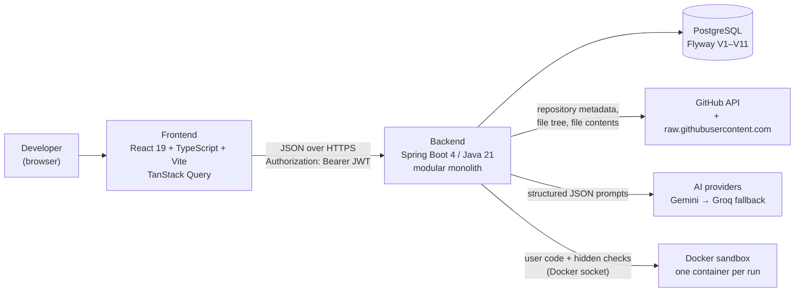
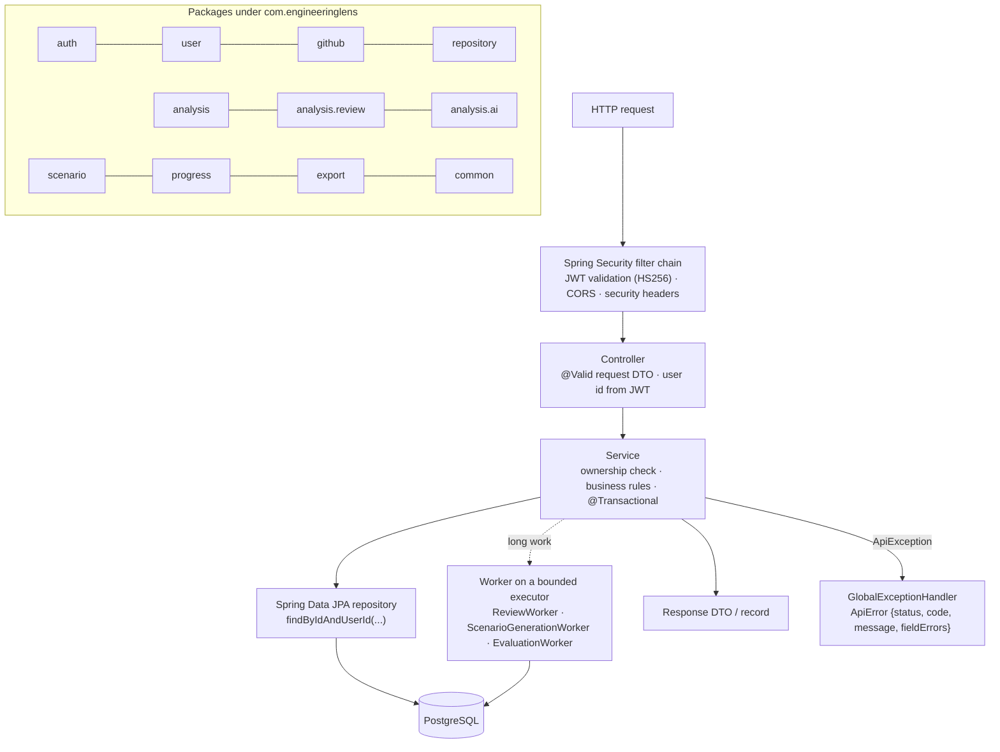
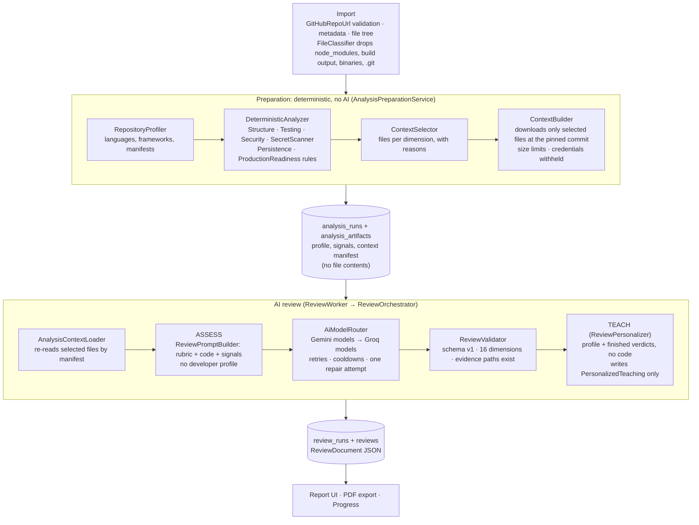
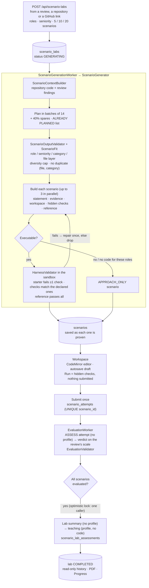
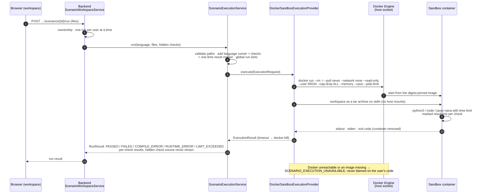
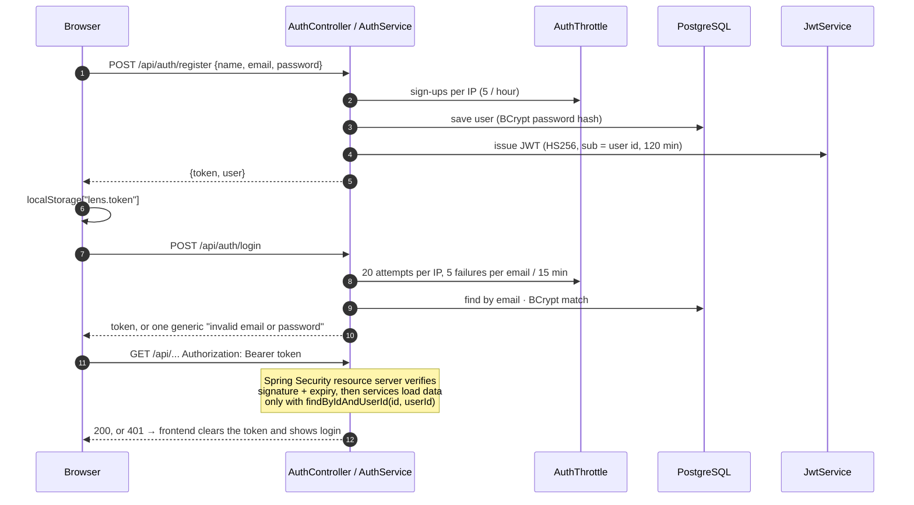
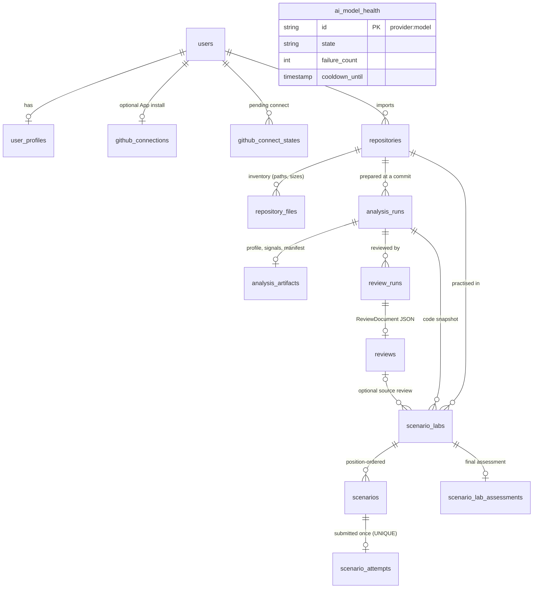
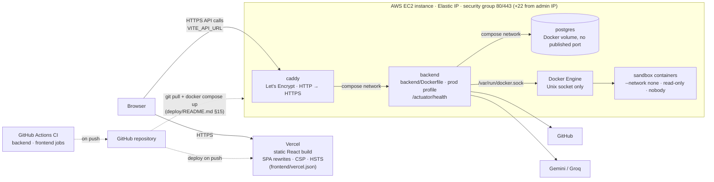

# Engiens architecture

Every diagram below is drawn from the code in this repository (class and table names are real). For the reasons
behind each choice, see [DECISIONS.md](DECISIONS.md). For setup, see [README.md](README.md).

1. [High-level system](#1-high-level-system)
2. [Backend request flow and modules](#2-backend-request-flow-and-modules)
3. [Repository review pipeline](#3-repository-review-pipeline)
4. [Scenario Lab pipeline](#4-scenario-lab-pipeline)
5. [Code execution (Docker sandbox)](#5-code-execution-docker-sandbox)
6. [Authentication](#6-authentication)
7. [Data model](#7-data-model)
8. [Deployment](#8-deployment)

---

## 1. High-level system

The browser only talks to the backend. GitHub tokens and AI keys stay server-side, and user code runs only in sandbox
containers, never in the backend process.

## 2. Backend request flow and modules

Every request takes the same path. A thin controller validates the DTO and passes the user id from the JWT to a
service. The service enforces ownership and business rules. A Spring Data repository reaches PostgreSQL, and DTOs come
back out. Long work (review, lab generation, evaluation) is handed to a worker on a bounded executor and polled by
the frontend.

| Package | Responsibility |
|---|---|
| `auth` | registration, login, JWT issuing, login/sign-up throttling, security configuration |
| `user` | users and engineering profiles |
| `github` | GitHub REST client, optional GitHub App (private repositories), repository reader |
| `repository` | import (metadata + file inventory), commit sync, per-repository work guard |
| `analysis` | review preparation without AI: profiler → deterministic rules → context selection |
| `analysis.ai` | provider-neutral AI layer: Gemini and Groq providers, model router, cooldowns |
| `analysis.review` | AI review: rubric, prompts, validation, assess/teach orchestration, persistence |
| `scenario` | Scenario Lab: `lab`, `generation`, `execution`, `workspace`, `evaluation`, `history` |
| `progress` | deterministic indicators computed on read from stored reviews and labs |
| `export` | server-side PDFs of reviews and lab assessments |
| `common` | `ApiError`, `ApiException`, `GlobalExceptionHandler`, `DailyLimit`, PDF typesetting |

The Java package is still `com.engineeringlens`, the project's working title; the product is Engiens.

## 3. Repository review pipeline

A review is two steps. The first, **preparation** (`AnalysisPreparationService`), uses no AI and runs at
`POST /api/repositories/{id}/analyses`. The second is the **AI review** (`ReviewService` → `ReviewWorker` →
`ReviewOrchestrator`), started at `POST /api/repositories/{id}/reviews` and polled until it completes.

Assessment never sees the developer profile, so the same commit gets the same verdicts whoever submits it. Teaching
sees the profile but no code, and it can only add `PersonalizedTeaching`; it cannot change a verdict. If teaching
fails, the review is still saved without personalised advice.

## 4. Scenario Lab pipeline

Lab statuses are `GENERATING → ACTIVE → FINALIZING → COMPLETED`, with `FAILED` and `CANCELLED` as the other end
states. A user has at most one open lab, enforced by the `active_user_id UNIQUE` column.

## 5. Code execution (Docker sandbox)

The same path runs locally and in production on EC2. `ScenarioExecutionService` builds every run;
`DockerSandboxExecutionProvider` (behind the `ExecutionProvider` interface, which tests replace with a fake) executes it
in a throwaway container. On EC2 the backend container reaches the host's Docker Engine through the mounted socket, so
sandbox containers are siblings of the backend, not children, and never join the compose network.

## 6. Authentication

Another user's resource returns **404**, not 403, so the response doesn't reveal that the id exists. Private
repositories use a separate, optional GitHub App flow with a single-use `state` (README → GitHub App).

## 7. Data model

There are no JPA associations (`@ManyToOne` etc.): entities hold foreign-key ids, and services load what they need
explicitly. This avoids lazy-loading surprises, and the relationships live in the Flyway schema:

| Table | Entity | Notes |
|---|---|---|
| `users`, `user_profiles` | `User`, `UserProfile` | email unique; profile keyed by user id |
| `github_connections`, `github_connect_states` | `GitHubConnection`, `GitHubConnectState` | installation id only; state expires in 10 min |
| `repositories`, `repository_files` | `ImportedRepo`, `RepoFile` | unique (user, owner, name); commit SHA pinned |
| `analysis_runs`, `analysis_artifacts` | `AnalysisRun`, `AnalysisArtifact` | manifest, never file contents |
| `review_runs`, `reviews` | `ReviewRun`, `StoredReview` | run status + validated document |
| `scenario_labs`, `scenarios`, `scenario_attempts`, `scenario_lab_assessments` | same names | attempts copy what they need, so history never depends on the workspace |
| `ai_model_health` | `AiModelHealth` | per-model cooldowns that survive restarts |

All foreign keys to `users` and `repositories` are `ON DELETE CASCADE`. A lab's link to its source review is
`ON DELETE SET NULL`, so a lab outlives the review it came from.

## 8. Deployment

This is the production topology; the step-by-step runbook is in [deploy/README.md](deploy/README.md).

