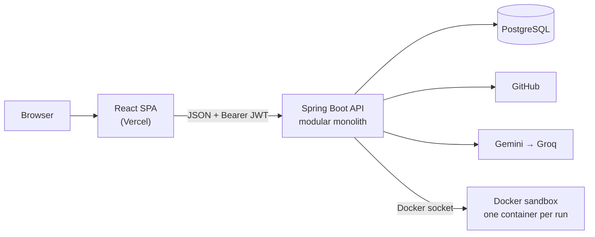

# Engiens

**Engiens reviews the code you actually built, tuned to where you are now, then puts you inside the production
problems most courses skip.**

You connect a GitHub repository and get a structured engineering review against an open 16-dimension rubric. Then
you practise realistic scenarios generated from *that* repository: fix the code against hidden checks, or explain your
approach. Your engineering progress is tracked over time from the evidence.

- **[ARCHITECTURE.md](ARCHITECTURE.md):** eight Mermaid diagrams (system, modules, review pipeline, Scenario Lab, code
  execution, auth, data model, deployment).
- **[DECISIONS.md](DECISIONS.md):** the engineering decisions, the alternatives considered, the trade-offs, and known
  limitations.
- **[deploy/README.md](deploy/README.md):** the production deployment runbook (AWS EC2 + Vercel).

---

## Contents

1. [The problem](#the-problem)
2. [Who it's for](#who-its-for)
3. [Product philosophy](#product-philosophy)
4. [Workflows](#workflows)
5. [Repository review](#repository-review)
6. [Personalisation without changing the verdict](#personalisation-without-changing-the-verdict)
7. [Scenario Lab](#scenario-lab)
8. [Progress](#progress)
9. [History and PDF export](#history-and-pdf-export)
10. [Architecture](#architecture)
11. [Security](#security)
12. [Tech stack](#tech-stack)
13. [Project structure](#project-structure)
14. [Run locally](#run-locally)
15. [Environment variables](#environment-variables)
16. [Testing and CI](#testing-and-ci)
17. [Deployment](#deployment)
18. [Limitations and trade-offs](#limitations-and-trade-offs)
19. [Future work](#future-work)

---

## The problem

Students and early-career developers write a lot of code but rarely get engineering feedback on it. They hear "it
works", not why a transaction boundary matters, or what happens when two requests arrive at once, or why a swallowed
exception will cost someone an hour in production. Generic AI review tools tend to give one of two things: a single
score, or a wall of style nits. Neither says what to learn next, and neither checks whether the advice was actually
understood.

## Who it's for

Students and early-career engineers who have built something real (a FastAPI service, a Spring Boot API, a React app)
and want feedback that:

- refers to their own files and lines;
- is honest about what's good and what's missing;
- is tuned to their level and stack;
- turns into practice they can actually do.

## Product philosophy

- **Explain, don't just score.** Every concern says what was observed, where, why it matters, and what to do instead.
  There is no single overall score.
- **An open rubric.** Engiens evaluates against a published rubric (`RubricDimension`). It claims no knowledge of any
  company's internal standards and does not measure anyone's "industry readiness".
- **The level tunes the advice, never the verdict.** A second-year student and a senior engineer get the same
  assessment of the same code. What changes is what each is told to learn next (see below).
- **Evaluate thinking, not just answers.** Scenario Lab evaluates investigation strategy, trade-offs and failure-mode
  reasoning, not only whether the checks pass.
- **AI is an assistant inside the product.** Deterministic analysis, selected context, validated structured output and
  stored evidence come first; the model fills in judgement.
- **Privacy by default.** Repository access is read-only and limited to the repositories the user chooses. Review
  records store file paths and hashes, not source code.

## Workflows

```text
Sign up → engineering profile → import a GitHub repository → prepare (deterministic) → AI review
        → findings + strengths + learning plan → Scenario Lab from that repository → run code / submit
        → evaluation + reference approach → lab assessment → Progress → history + PDF
```

1. **Profile.** Level (student year or work experience), languages, frameworks, databases, experience areas and goals.
2. **Import.** Paste a GitHub link or pick from your repositories. The URL is validated (GitHub only), the commit is
   pinned, and the file inventory is classified: `node_modules`, build output, vendored code, binaries and `.git` are
   ignored.
3. **Review.** Preparation without AI (profile, deterministic rules, context selection), then the AI review, as a
   visible background job.
4. **Scenario Lab.** Generate 5, 10 or 20 scenarios for chosen roles and seniority. Work them in a code editor, run
   hidden checks, submit, and read the evaluation.
5. **Progress.** Indicators per engineering area, each with its reason and evidence.

## Repository review

### The rubric

Sixteen dimensions, each with explicit reviewer questions (`backend/.../analysis/review/model/RubricDimension.java`):

| | | | |
|---|---|---|---|
| Correctness & Feature Implementation | Architecture & Modularity | System Design & Scalability | Backend Engineering |
| API Design & Integration | Data & Persistence | Concurrency & Consistency | Performance & Efficiency |
| Error Handling & Resilience | Security | Testing & Quality Assurance | Code Quality & Maintainability |
| Production Readiness & Operations | Dependencies & External Services | Documentation & Developer Experience | Frontend & Client Engineering |

Each dimension gets an **assessment**: `Strong`, `Solid`, `Developing`, `Needs attention`, or `Not assessable` when
the repository has nothing to judge, such as a frontend dimension for a CLI tool. It also gets a **confidence**, plus
strengths and **concerns** with a severity, file, line range and evidence. Rubric limits are written into the prompt
itself. For example, "This is not a complete security audit." and "'Tests detected' is not 'good coverage'; coverage
is never measured."

### Pipeline

```text
Import ─▶ RepositoryProfiler ─▶ DeterministicAnalyzer ─▶ ContextSelector ─▶ ContextBuilder        (no AI)
                                  (structure, testing,      (files per dimension,   (downloads only the selected
                                   secrets, security,        with reasons)           files at the pinned commit,
                                   persistence, prod rules)                          size limits, credentials withheld)
      ─▶ ASSESS (AI, no profile) ─▶ ReviewValidator ─▶ TEACH (AI, profile, no code) ─▶ stored ReviewDocument
```

The whole repository is never sent to a model. It sees a selected, size-limited context with the reasons each file
was chosen, plus the deterministic signals. See [ARCHITECTURE.md §3](ARCHITECTURE.md#3-repository-review-pipeline).

### A concrete finding

```text
Dimension:   Concurrency & Consistency                         Assessment: Developing   Confidence: Medium
Concern:     Duplicate orders under retry                      Severity: High
Where:       app/services/orders.py, lines 41–58
Observed:    place_order() checks for an existing order, then inserts, in two separate statements
             with no unique constraint or idempotency key.
Why:         Two concurrent requests (a double click, a client retry) can both pass the check
             and create two orders. The customer is charged twice.
Improve:     Add a unique constraint or idempotency key and handle the conflict; treat the
             check as an optimisation, not the guarantee.
```

### AI layer

- **Provider abstraction.** `AiProvider` has two implementations (Gemini, Groq). `AiModelRouter` tries Gemini models
  in order, then Groq. Transient errors get two retries with backoff. A failing model gets a persisted cooldown (1
  minute, doubling up to 30 minutes), and the error is classified (rate limit, context too large, retired model, …).
- **Validation.**
  - Output must parse into the typed `ReviewDocument` (schema version 1): all 16 dimensions, known enums, bounded
    sizes.
  - Evidence pointing at files the model wasn't shown is removed.
  - One repair attempt sends the validation errors back to the model. A second failure ends the run with a clear error.
- **No provider configured?** The app still runs; starting a review explains that AI isn't configured.

## Personalisation without changing the verdict

Two separate AI calls:

| | Sees code | Sees profile | Writes |
|---|---|---|---|
| **ASSESS** | yes | **no** | assessments, concerns, strengths |
| **TEACH** | **no** | yes | `PersonalizedTeaching`: what's good *for your level*, what's expected but missing, the next step, advanced topics |

So the same commit gets the same verdicts for a second-year student and for an experienced engineer. Only the
explanation differs:

> **Second-year student, Python/FastAPI/PostgreSQL:** "Separating routes from persistence is already good for your
> level. A next step is a service layer with clear transaction boundaries."
>
> **Experienced backend engineer:** "Consider idempotency keys and isolation levels for the order flow."

Teaching is best-effort. If it fails, the review is still saved and shown without personalised advice.

## Scenario Lab

### What a lab is

A lab is a set of production problems **generated from your repository**, not taken from a fixed bank. You choose:

- **Roles:** for example Backend, Frontend, Full-Stack, DevOps, Cloud, AI/ML or Software Architect.
- **Seniority:** Beginner, SDE1, SDE2, SDE3 or Senior Architect.
- **Size:** 5, 10 or 20 scenarios.

You can start a lab from a finished review, an imported repository, or a GitHub link. Each scenario has a statement,
evidence (logs, metrics, code), the workspace files, hidden checks, a reference solution and a rubric.

### Code-first, with an approach fallback

- **Code mode** (the default where possible). Edit the real files in a CodeMirror editor. **Run** executes your
  version against hidden checks and shows each check's pass/fail and message; nothing is submitted. Python,
  JavaScript, TypeScript and Java are supported.
- **Approach mode.** Explain what you would investigate first, why, and what you would change. Every scenario offers
  it. Scenarios that aren't about code at all (some architecture, cloud or networking problems) are approach-only.

Each scenario is **submitted once**. The evaluation reports:

- what you identified correctly;
- what you missed;
- why your approach may fail;
- what to investigate first;
- a stronger approach and the reference fix.

The verdict uses the same scale as reviews. When every scenario is evaluated, the lab gets an overall assessment and
learning recommendations, written in the same assess-then-teach split.

### Generation and validation

- **Planning.** Plans are made in batches with an "already planned" list, and spare scenarios are generated so that
  rejections don't shrink the lab.
- **Fit.** `ScenarioFit` rejects scenarios that don't match the selected roles, seniority or code layer: a
  frontend-only lab gets no database-migration problems. Diversity rules stop a 20-scenario lab from becoming 20
  variations of one bug.
- **Proof before publication.** `HarnessValidator` runs every executable scenario in the sandbox *before anyone sees
  it*. The starter code must fail at least one check (it reproduces the problem), the checks that ran must be exactly
  the declared ones, and the reference solution must pass them all. If that fails, the scenario is repaired once,
  and otherwise dropped.
- **Delivery.** Scenarios appear one by one as they are proven, so you can start before the lab finishes generating.

### Where code runs

User code runs the same way in development and in production on AWS EC2: `ScenarioExecutionService` →
`DockerSandboxExecutionProvider` → Docker Engine on the same host → one throwaway container per Run or Submit.

| | |
|---|---|
| Isolation | `--network none`, read-only image with small in-memory `/work` and `/tmp`, user 65534 (`nobody`), all capabilities dropped, `no-new-privileges`, memory (no swap), CPU, process and open-file limits, digest-pinned images, never pulled during a run |
| Inputs | the workspace, the Engiens language runner and the hidden checks, streamed in as a tar archive: no host folder is mounted and none of the host's environment variables are passed in |
| Results | only output lines carrying a one-time marker count as check results, so user code can't fake a pass |
| Reached by | the Docker CLI in the backend; on EC2, through the host's Docker socket, mounted only into the backend container ([DECISIONS.md §14](DECISIONS.md#14-code-execution-a-throwaway-docker-container-per-run)) |

With no execution available (Docker not running, images missing, or `SCENARIO_EXECUTION_ENABLED=false`), the lab
setup screen says so, and labs are generated approach-only rather than pretending code can run.

## Progress

`GET /api/progress` derives indicators per rubric dimension from stored reviews and completed labs. It is
deterministic, uses no AI and has no score:

- **Consistent strength**, **recurring gap**, **improving**, **inconsistent**, **mixed**, **not enough history**,
  **not assessed**.
- Every indicator shows its reason and the evidence (which review or lab, which commit, which rating).
- Reviews of the same commit count once, and low-confidence assessments are shown but not counted.
- A better rating at a later commit is reported as a **project-level change** (the code improved). Developer-level
  "improving" needs Scenario Lab gains across labs, or gains in more than one repository.
- Scenario categories map onto the same 16 dimensions, so reviews and labs feed one view.

## History and PDF export

- **Immutable history.**
  - A completed review is never edited; regenerating creates a new one, and older ones stay in the review history.
  - A completed lab becomes a read-only record under its repository, with every attempt, evaluation and the final
    assessment.
- **Commit sync.** "Check for new commits" moves an imported repository to its latest commit, so it can be reviewed
  again. Past reviews keep their commit.
- **PDF.** `GET /api/reviews/{id}/pdf` and `GET /api/scenario-labs/{id}/assessment/pdf` are typeset on the server from
  stored data (OpenPDF), so a PDF always matches what the page shows.

## Architecture

A **modular monolith**: one Spring Boot application with packages by capability. Scenario Lab code runs outside it,
in throwaway Docker sandbox containers.



| Package | Responsibility |
|---|---|
| `auth` | registration, login, JWT, throttling, security configuration |
| `user` | users and engineering profiles |
| `github` | GitHub client, optional GitHub App, repository reader |
| `repository` | import, file inventory, commit sync |
| `analysis` | preparation without AI: profiler, deterministic rules, context selection |
| `analysis.ai` | provider-neutral AI layer and model router |
| `analysis.review` | AI review: prompts, validation, assess/teach, persistence |
| `scenario` | labs, generation, execution, workspace, evaluation, history |
| `progress` | deterministic progress indicators |
| `export` | server-side PDFs |
| `common` | `ApiError`, global exception handler, daily limits |

**Conventions.**

- Controllers are thin and services own rules and transactions.
- DTO records sit at the API boundary, and JPA entities are never returned.
- Every failure returns the same JSON shape: `{"status", "code", "message", "fieldErrors"}`.
- Long work runs as a job (queued → running → completed/failed) that the frontend polls. Work interrupted by a
  restart is marked failed on start-up instead of hanging.
- Schema changes go only through Flyway migrations (`V1`–`V11`); Hibernate validates the schema and never changes it.

**Error handling.** Expected failures carry specific codes and user-facing messages. Examples:

- GitHub: `INVALID_REPOSITORY_URL`, repository not found, rate limit, empty repository.
- AI: unavailable, context too large, malformed output.
- Execution: `SCENARIO_EXECUTION_UNAVAILABLE`.
- Requests: validation errors per field.

Provider details stay in logs; stack traces never reach users. The frontend shows explicit loading, empty and error
states.

All diagrams: [ARCHITECTURE.md](ARCHITECTURE.md).

## Security

| Area | What's in place |
|---|---|
| Passwords | BCrypt. Login returns one generic error for an unknown email and a wrong password |
| Sessions | Stateless HS256 JWT (secret ≥ 32 bytes from the environment, 120 min), verified by Spring Security |
| Authorisation | Every user-owned query is scoped by the user id from the token (`findByIdAndUserId`); another user's data returns 404 |
| Abuse | 20 logins per IP and 5 failures per email per 15 min; 5 sign-ups per IP per hour; daily caps on reviews (10) and labs (5); one code run per user at a time |
| Input | Bean Validation on every request DTO; GitHub URLs parsed and restricted to github.com; code edits are accepted only for the scenario's own editable files, and workspace paths are validated before any run |
| Secrets | Only from environment variables; `.env`, `secrets/` and `*.pem` are git-ignored; API keys redacted from logs; the GitHub App stores only an installation id and mints short-lived tokens per request |
| Headers | API: `Content-Security-Policy: default-src 'none'; frame-ancestors 'none'`, `Referrer-Policy: no-referrer`, HSTS on HTTPS. Frontend: CSP, HSTS, `X-Content-Type-Options`, `frame-ancestors 'none'` (`frontend/vercel.json`) |
| CORS | Only the configured frontend origin(s) |
| User code | Never runs in the backend process: a throwaway Docker sandbox container per run, locally and in production on EC2 (no network, read-only, user `nobody`, resource limits) |
| Source code | Reviews store paths, hashes and the model's findings; excerpts are re-read from GitHub at the reviewed commit when you open them |

Engiens points out obvious security issues it can see in source code. It is **not** a security audit.

## Tech stack

| Layer | Technology |
|---|---|
| Frontend | React 19, TypeScript, Vite, Tailwind CSS, React Router, TanStack Query, CodeMirror 6 |
| Backend | Java 21, Spring Boot 4 (Web, Security + OAuth2 resource server, Data JPA, Validation, Actuator), Flyway, OpenPDF |
| Database | PostgreSQL 17 (H2 in PostgreSQL mode for tests) |
| AI | Google Gemini and Groq over HTTP, behind `AiProvider` |
| Code execution | Docker Engine: one sandbox container per run (locally and in production) |
| Tooling | Maven wrapper, npm, Vitest + Testing Library, JUnit 5 + Spring Boot Test, oxlint, GitHub Actions |
| Hosting | Vercel (frontend); AWS EC2, Ubuntu 24.04, Docker Compose (Caddy, backend, PostgreSQL, Docker sandbox) |

## Project structure

```text
.
├── backend/                 Spring Boot API
│   ├── src/main/java/com/engineeringlens/   modules (see Architecture)
│   ├── src/main/resources/  application*.properties, db/migration (Flyway V1–V11)
│   ├── src/test/java/       unit + integration tests (H2)
│   └── Dockerfile           production image (non-root, health check, Docker CLI for the sandbox)
├── frontend/                React SPA
│   ├── src/pages/           landing, auth, onboarding, dashboard, profile, repository, review
│   ├── src/scenario-lab/    lab setup, workspace, completion
│   ├── src/scenario-history/, src/progress/, src/review/, src/shell/, src/shared/
│   └── vercel.json          SPA rewrites + security headers
├── deploy/                  EC2 production stack: compose file, Caddyfile, env template, runbook,
│                            sandbox-images, backup, restore and smoke-test scripts
├── docker-compose.yml       local PostgreSQL
├── Makefile                 make backend | frontend | test | sandbox-images | stop
├── ARCHITECTURE.md, DECISIONS.md
└── .env.example
```

The Java package `com.engineeringlens` keeps the project's working title; the product is Engiens.

## Run locally

Requirements: JDK 21+, Node 22+, Docker.

```bash
cp .env.example .env              # set DB_PASSWORD and JWT_SECRET (openssl rand -base64 48); AI keys optional
make sandbox-images               # once: pulls the digest-pinned Python/Node/Java sandbox images
make backend                      # starts PostgreSQL (docker compose), then the API on :8080
make frontend                     # installs dependencies if needed, then the UI on :5173
```

Or by hand:

```bash
docker compose up -d                                  # PostgreSQL
cd backend && ./mvnw spring-boot:run                  # API on :8080
cd frontend && cp .env.example .env && npm install && npm run dev   # UI on :5173
```

Open http://localhost:5173, create an account, complete the profile, and paste a public GitHub repository link.
Without AI keys, imports and preparation work, but reviews and labs report that AI isn't configured. Without Docker,
Run is unavailable and labs are approach-only.

### GitHub App (optional, for private repositories)

Without these settings, Engiens works with public repositories only. With them, onboarding offers "Include private
repositories": the user installs the GitHub App and chooses which repositories to share (read-only).

1. GitHub → Settings → Developer settings → GitHub Apps → New GitHub App.
2. Set the callback URL to `http://localhost:8080/api/github/callback` (and `https://<API_HOST>/api/github/callback` for
   production). Tick
   "Request user authorization (OAuth) during installation", and untick Webhook → Active.
3. Under repository permissions, set Contents → Read-only. Nothing else.
4. Note the App ID and Client ID, then generate a client secret and a private key. Save the key as
   `secrets/github-app.pem` (git-ignored) and fill in the `GITHUB_APP_*` values in `.env`.

The redirect carries a random, single-use `state` stored server-side, which expires in 10 minutes. The backend
accepts only an installation that GitHub confirms the signed-in user can access. Only the installation id is stored;
access tokens are minted per request and never persisted.

## Environment variables

Local values live in the root `.env` (see `.env.example`); production values are listed in
`deploy/.env.production.example` and live only in `deploy/.env` on the EC2 server. Nothing secret is committed.

| Variable | Required | Purpose |
|---|---|---|
| `DB_URL`, `DB_USERNAME`, `DB_PASSWORD` (`DB_NAME` for compose) | yes | PostgreSQL connection |
| `JWT_SECRET` | yes | HS256 signing key, at least 32 bytes |
| `JWT_TTL_MINUTES` | no (120) | token lifetime |
| `CORS_ALLOWED_ORIGIN`, `FRONTEND_URL` | yes in prod | allowed frontend origin(s); redirect target after GitHub App install |
| `GEMINI_API_KEY`, `GROQ_API_KEY` | for AI | either or both; Gemini is tried first |
| `GITHUB_TOKEN` | no | raises GitHub's API limit from 60 to 5000 requests/hour |
| `GITHUB_APP_ID`, `GITHUB_APP_CLIENT_ID`, `GITHUB_APP_CLIENT_SECRET`, `GITHUB_APP_SLUG`, `GITHUB_APP_PRIVATE_KEY_PATH` or `GITHUB_APP_PRIVATE_KEY` | no | private repositories via the GitHub App |
| `SCENARIO_EXECUTION_ENABLED` | no (true) | `false` = approach-only labs |
| `SCENARIO_EXECUTION_MAX_CONCURRENT` | no (2) | sandbox containers running at once, across all users |
| `REVIEWS_PER_DAY`, `LABS_PER_DAY` | no (10, 5) | per-user daily caps (0 = no cap) |
| `VITE_API_URL` (frontend) | yes | backend base URL |
| `API_HOST`, `ACME_EMAIL`, `DOCKER_GID`, `BACKEND_MEMORY`, `ENGIENS_VERSION` | production compose only | HTTPS hostname, certificate email, Docker socket group, backend memory limit, image tag |

## Testing and CI

```bash
cd backend && ./mvnw test                         # JUnit 5 + Spring Boot Test, H2 in PostgreSQL mode
cd frontend && npm test && npm run lint && npm run build   # Vitest, oxlint, tsc + Vite build
make test                                         # backend + frontend
```

- **Backend (50 test classes).**
  - *Unit tests:* URL validation, file classification, deterministic rules, context selection, review and scenario
    validation, the model router (retries, cooldowns, fallback), scenario fit and de-duplication, the progress
    calculator, rate limiting.
  - *Integration tests:* register → login → authenticated requests; import → prepare → review → retrieve; full lab
    lifecycle; workspace run/submit; progress; PDF export; cross-user access returns 404.
  - *Execution:* real Docker sandbox tests (`SandboxExecutionTest`, `HarnessValidatorSandboxTest`) run Python,
    JavaScript, TypeScript and Java in real containers and try to escape them (network, database, secrets, host files,
    privileges, memory, output, endless runs). They need Docker and the sandbox images, and are skipped, not faked,
    without them.
  - *Production stack:* `ProductionStackTest` checks `deploy/docker-compose.prod.yml`: only Caddy publishes ports, only
    the locked-down backend gets the Docker socket, and code execution is always on.
- **Frontend (Vitest):** authentication, onboarding, dashboard import, review rendering, Scenario Lab setup and
  workspace, history, Progress.
- **CI** (`.github/workflows/ci.yml`, on every push and pull request) has two jobs:
  - backend (JDK 21, pulls the digest-pinned sandbox images, `./mvnw test` including the real sandbox tests);
  - frontend (`npm ci`, tests, lint, typecheck + build).

## Deployment

Engiens runs in production on **AWS EC2** with the frontend on **Vercel**:

```text
Browser ──HTTPS──▶ Vercel (React build)
   └──HTTPS──▶ Caddy on AWS EC2 (Ubuntu 24.04, Elastic IP; automatic Let's Encrypt certificate)
                 └─▶ Spring Boot backend (prod profile, not published)
                       ├─▶ PostgreSQL container (private: compose network only)
                       ├─▶ Docker Engine (Unix socket) ─▶ isolated Scenario Lab containers
                       └─▶ GitHub (incl. the GitHub App) · Gemini · Groq
```

One `docker compose` stack (`deploy/docker-compose.prod.yml`) runs Caddy, the backend and PostgreSQL. Only Caddy
publishes ports (80/443); PostgreSQL and the backend are reachable only on the compose network; only the backend
container gets the Docker socket. `ProductionStackTest` keeps these properties in CI.

The path for a new contributor is: [Run locally](#run-locally) → [Testing and CI](#testing-and-ci) → the step-by-step
EC2 runbook in **[deploy/README.md](deploy/README.md)** (AWS account and cost safety, instance, security group, Elastic
IP, Docker, variables, Vercel, GitHub App, backups, updates, rollback, shutdown). The production Spring profile
(`SPRING_PROFILES_ACTIVE=prod`) requires the CORS and frontend URLs, trusts Caddy's forwarded headers and enables
graceful shutdown.

## Limitations and trade-offs

- **AI judgement.** Reviews are AI-assisted judgement against an open rubric. They are not an audit, they don't
  measure coverage, and they are not a measure of anyone's level.
- **Repository size.** Large repositories are reviewed through a selected, size-limited context, not in full.
- **One production VM.** EC2 runs everything on one instance: a single point of failure, and updates, backups and
  monitoring are our job. The backend container holds the host's Docker socket (root-equivalent on that host); it is
  the only container with it and is read-only, non-root and publishes no port.
- **JWT storage.** The JWT is in `localStorage` (simpler cross-origin setup, at the cost of exposure to XSS) and can't
  be revoked before it expires.
- **In-memory limits.** Rate limits and run guards are in memory, so they apply per backend instance.
- **Background work.** Background jobs run on in-process executors. A restart marks in-flight work as failed instead
  of resuming it.
- **Free-tier AI.** Free-tier AI quotas can delay or fail reviews. Routing and cooldowns reduce this but can't remove
  it.

The reasoning behind each is in [DECISIONS.md](DECISIONS.md).

## Future work

- Pull-request review mode and scheduled re-analysis on new commits.
- Stronger sandboxing on the production host (e.g. the gVisor runtime for sandbox containers, a Docker socket proxy
  that only allows the calls the backend needs), and a managed database with automated backups.
- HttpOnly cookie sessions with CSRF protection and token revocation.
- Shared rate-limit storage for multiple backend instances.
- Deeper static analysis (ASTs per language) to give the model stronger deterministic evidence.
- Scenario recommendations driven by recurring gaps in Progress.
